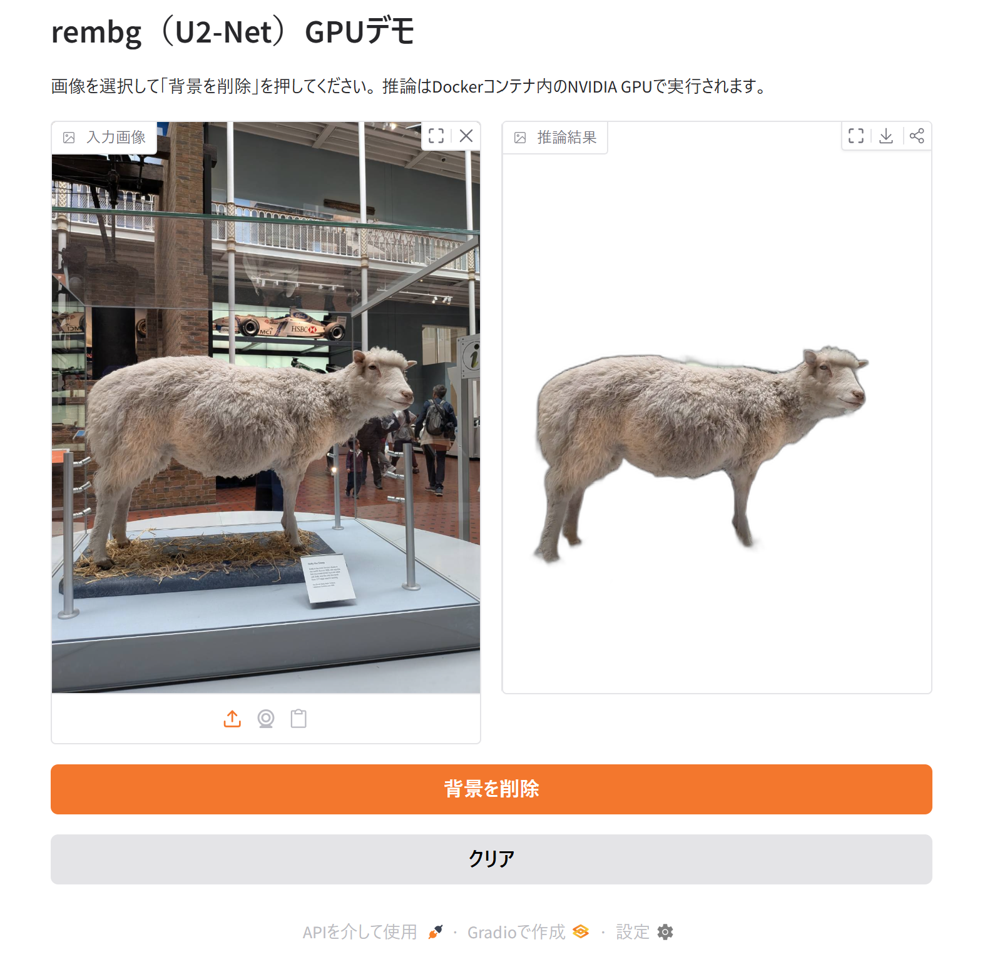
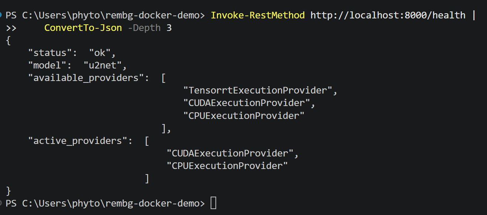
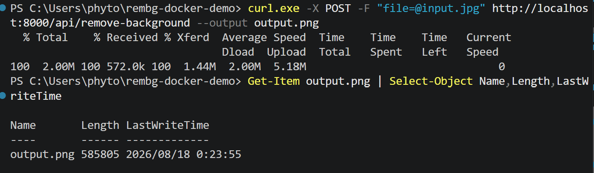
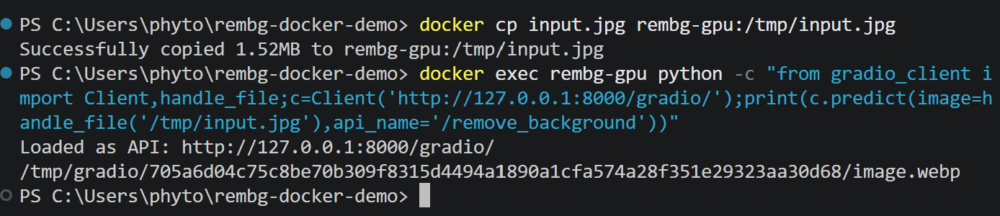

# rembg GPU Docker Demo

学習済みモデル rembg（U2-Net）をDockerコンテナ上で動かし、画像の背景を削除するデモ環境です。

以下の3種類の方法から推論を実行できます。

- GradioのGUI
- GradioのAPI
- Gradioとは独立したFastAPIの推論API

推論にはNVIDIA GPUを使用します。

## 動作確認環境

- Windows
- Docker Desktop（WSL2バックエンド）
- NVIDIA GeForce RTX 3090（24GB）
- NVIDIA CUDAコンテナ：12.6.3
- Python 3.12
- rembg：2.0.79
- onnxruntime-gpu：1.23.2
- FastAPI：0.128.0
- Gradio：6.2.0

## ディレクトリ構成

```text
rembg-docker-demo/
├── app/
│   ├── __init__.py
│   ├── inference.py
│   └── main.py
├── .dockerignore
├── .gitignore
├── Dockerfile
├── README.md
└── requirements.txt
```

## 構成

- `app/inference.py`
  - rembgの推論セッションを作成します。
  - `CUDAExecutionProvider`が使用されていることを確認します。
  - 読み込んだモデルを再利用して画像の背景を削除します。

- `app/main.py`
  - FastAPIのエンドポイントを提供します。
  - GradioのGUIとAPIをFastAPI上にマウントします。

- `Dockerfile`
  - CUDA、Python、rembgなどを含むDockerイメージを作成します。

## Dockerイメージのビルド

プロジェクトのルートディレクトリで実行します。

```powershell
docker build --progress=plain -t rembg-gpu-demo .
```

## コンテナの起動

```powershell
docker run --rm --gpus all -p 8000:8000 -v rembg-models:/models --name rembg-gpu rembg-gpu-demo
```

`rembg-models`というDockerボリュームを使用することで、ダウンロードしたU2-Netのモデルをコンテナ終了後も保持します。

初回推論時はモデルをダウンロードするため、少し時間がかかります。

## アクセス先

コンテナ起動後、次のURLをブラウザで開きます。

| 機能 | URL |
|---|---|
| トップページ | http://localhost:8000/ |
| GPU動作確認 | http://localhost:8000/health |
| FastAPIドキュメント | http://localhost:8000/docs |
| Gradio GUI | http://localhost:8000/gradio/ |

## GPUの動作確認

PowerShellから次のコマンドを実行します。

```powershell
Invoke-RestMethod http://localhost:8000/health |
    ConvertTo-Json -Depth 3
```

正常にGPUが使用されている場合、実行結果の`active_providers`に以下が表示されます。

```json
[
  "CUDAExecutionProvider",
  "CPUExecutionProvider"
]
```

## Gradio GUIから推論する

ブラウザで次のURLを開きます。

```text
http://localhost:8000/gradio/
```

画像を選択して「背景を削除」を押すと、背景を削除した画像が表示されます。

## FastAPIから推論する

PowerShellでは`curl`ではなく、`curl.exe`を使用します。

```powershell
curl.exe -X POST `
  -F "file=@input.jpg" `
  http://localhost:8000/api/remove-background `
  --output output.png
```

成功すると、背景を削除した画像が`output.png`として保存されます。

## Gradio APIから推論する

PythonからGradio APIを利用する例です。

```python
from gradio_client import Client, handle_file

client = Client("http://localhost:8000/gradio/")

result = client.predict(
    image=handle_file("input.jpg"),
    api_name="/remove_background",
)

print(result)
```

利用可能なGradio APIを確認する場合は、次のように実行します。

```python
from gradio_client import Client

client = Client("http://localhost:8000/gradio/")
client.view_api()
```

## コンテナの停止

コンテナを起動しているターミナルで`Ctrl + C`を押します。

別のPowerShellから停止する場合は、次のコマンドを実行します。

```powershell
docker stop rembg-gpu
```

## トラブルシューティング

### CUDAライブラリのバージョン不一致

以下のようなエラーが発生する場合があります。

```text
libcublasLt.so.13: cannot open shared object file
```

これは、ONNX Runtimeが要求するCUDAのバージョンと、Dockerイメージ内のCUDAのバージョンが一致していない場合に発生します。

このプロジェクトでは、CUDA 12環境に合わせて以下のバージョンを固定しています。

```text
onnxruntime-gpu==1.23.2
```

### モデルの保存先

rembg 2.0.79では、モデルの保存先を次の環境変数で設定します。

```dockerfile
ENV U2NET_HOME=/models
```

## 動作確認結果

以下を確認しました。

- DockerコンテナからNVIDIA GPUを利用できる
- U2-Netの推論で`CUDAExecutionProvider`が有効になる
- Gradio GUIから画像を入力して背景を削除できる
- Gradio APIから画像推論を実行できる
- FastAPIへcurlで画像を送信し、PNG形式の推論結果を取得できる

## 動作スクリーンショット

### Gradio GUI

入力画像から背景を削除した結果です。



### GPU動作確認

`CUDAExecutionProvider`が有効になっていることを確認しました。



### FastAPIによる推論

独立したFastAPIエンドポイントへ`curl`で画像を送信し、推論結果を取得しました。



### Gradio APIによる推論

GradioのAPIエンドポイントから推論結果が生成されることを確認しました。



## 作業時間・難易度・感想

- 作業時間：約5時間
  - WSL2、Docker、FastAPIなどの事前学習時間は含めていません。
  - VS Codeの初回セットアップ、実装、動作確認、GitHubへの公開作業を含みます。

- 難易度：
  - LLMの支援を受けながら手順を進めるという点では、実装操作そのものはそれほど難しくありませんでした。
  - 一方で、Docker、CUDA、ONNX Runtime、FastAPI、Gradioの関係を含め、技術内容を自力で完全に説明・判断する難易度は高いと感じました。

- 感想：
  - 全体の仕組みを大まかに理解した後は、LLMの指示に沿って実装と検証を進めることで、短時間で動作する環境を構築できました。
  - 特に、CUDAとONNX Runtimeのバージョン不一致など、複数の環境要因が関係する問題の切り分けにLLMが有効でした。
  - 現時点では実装内容のすべてを完全に理解しているわけではないため、AIによる誤りや重要な設定ミスを、知識だけで自力で見抜くことは難しいと感じました。
  - そのため、初心者でも確認できる具体的な合格条件を事前に決め、GPUの使用状況、APIの応答、生成画像などを一つずつ動作確認することが重要だと感じました。また、変更を小さく区切ってGitに保存し、自分では判断できない重要な箇所については経験者にレビューを依頼したいと考えています。

## 参考資料

- [rembg](https://github.com/danielgatis/rembg)
- [FastAPI](https://fastapi.tiangolo.com/)
- [Gradio](https://www.gradio.app/)
- [NVIDIA CUDA Containers](https://hub.docker.com/r/nvidia/cuda)